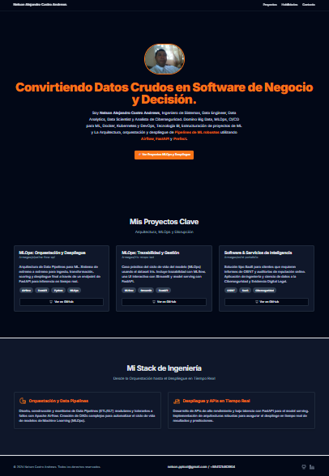

## Nelson Castro Andrews - Portafolio de Ingeniería y Ciencia de Datos

Este es el repositorio de mi portafolio personal, desarrollado para mostrar mis habilidades y proyectos clave en las áreas de MLOps, Ingeniería de Datos y Desarrollo de Software.

 <!-- ¡No olvides añadir una captura de pantalla en la carpeta public! -->

### ✨ Stack Tecnológico

Este proyecto está construido con un stack moderno y de alto rendimiento:

- **Framework:** [Next.js](https://nextjs.org/) (con App Router)
- **Lenguaje:** [TypeScript](https://www.typescriptlang.org/)
- **Estilos:** [Tailwind CSS](https://tailwindcss.com/)
- **Componentes UI:** [shadcn/ui](https://ui.shadcn.com/)
- **Gestión de Formularios:** [React Hook Form](https://react-hook-form.com/)
- **Iconos:** [Lucide React](https://lucide.dev/)

### 🚀 Cómo Empezar

Si deseas ejecutar este proyecto en tu entorno local, sigue estos pasos:

1.  **Clona el repositorio:**
    ```bash
    git clone https://github.com/Armegas/portafolio.git
    cd portafolio
    ```
2.  **Instala las dependencias:**
    ```bash
    npm install
    ```
3.  **Ejecuta el servidor de desarrollo:**
    ```bash     
    npm run dev
    ```

Abre [http://localhost:3000](http://localhost:3000) en tu navegador para ver el resultado (o el puerto que tengas configurado).